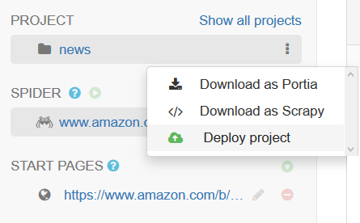

.. _projects:

========
Projects
========

A project in ScrapeConfig consists of one or more :ref:`spiders <spiders>` and can be deployed to any `scrapyd`_ instance.

Deployment
==========

You can deploy your ScrapeConfig projects by select ``Deploy project`` under Project on left siderbar. 

